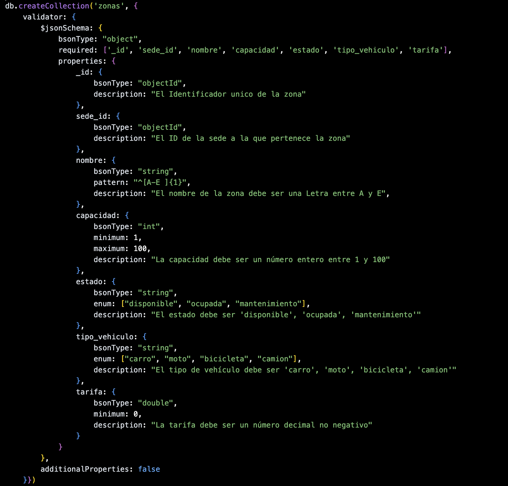
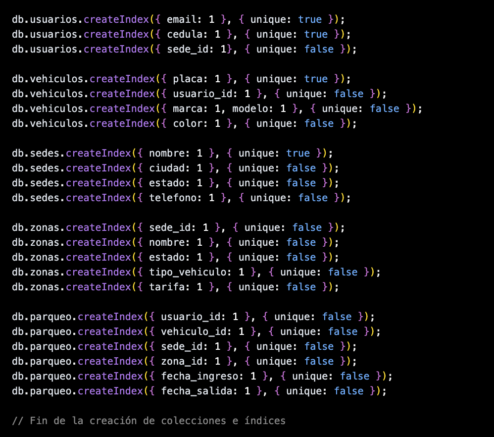
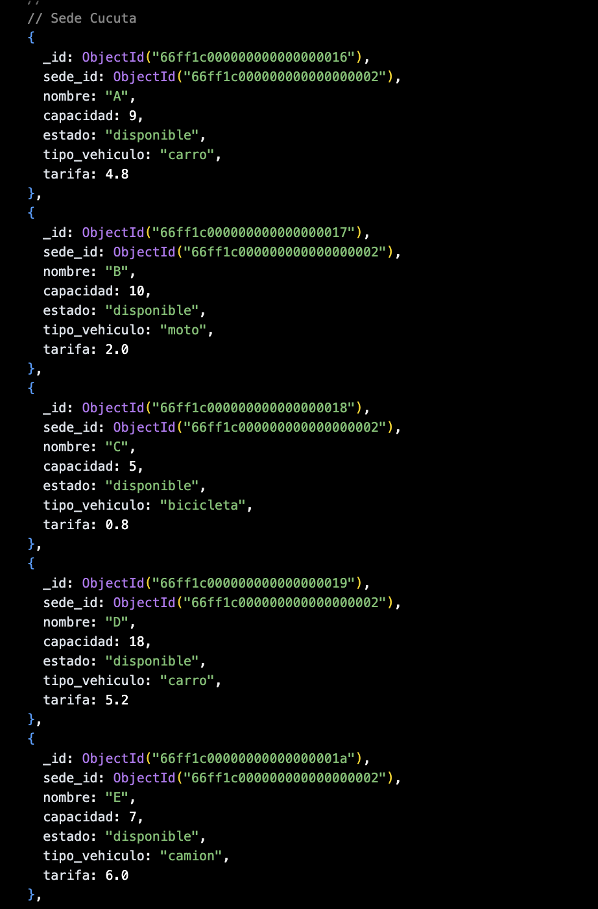
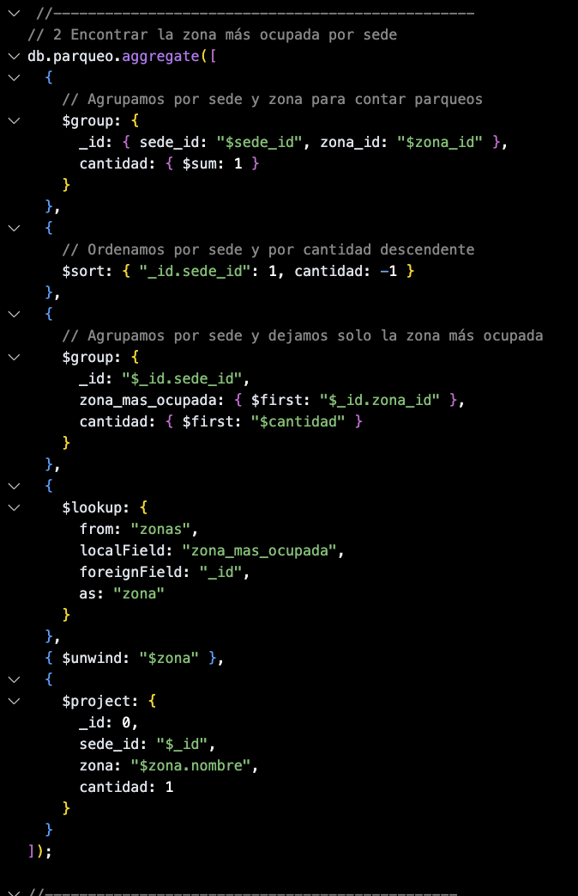

-----

# 🚗 Campus Parking - Sistema de Parqueadero con MongoDB

## 🚀 Introducción

**Campus Parking** es un sistema de gestión de parqueaderos diseñado para una organización con múltiples sedes. La plataforma permite administrar el ciclo completo de estacionamiento de vehículos: desde el registro de ingresos y salidas, hasta la gestión de usuarios (empleados y clientes) y el control de las zonas de parqueo. Todo el backend de datos se ha implementado en **MongoDB** para aprovechar su flexibilidad, escalabilidad y potentes capacidades de consulta.


-----

## 💡 ¿Por qué MongoDB?

MongoDB fue la elección estratégica para este proyecto por varias razones clave:

  * **Modelo Flexible:** Su modelo basado en **documentos** (BSON) es ideal para manejar estructuras de datos que pueden cambiar o tener anidamientos complejos, como los datos de un parqueo.
  * **Relaciones Claras:** Facilita el manejo de referencias entre colecciones, manteniendo un diseño limpio y desacoplado.
  * **Consultas Potentes:** Ofrece un robusto framework de **agregaciones complejas** para analíticas y la capacidad de realizar **transacciones multi-documento** que garantizan la atomicidad.
  * **Integridad de Datos:** Permite definir **validaciones personalizadas** a nivel de colección mediante el uso de `$jsonSchema`.
  * **Alto Rendimiento:** Proporciona un excelente rendimiento en operaciones de lectura y escritura, crucial para un sistema de alta transaccionalidad.

-----

## 🏗️ Diseño del Modelo de Datos

### Colecciones Creadas

  * `sedes`
  * `zonas`
  * `usuarios`
  * `vehiculos`
  * `parqueo`

### Decisiones de Diseño: Referencias vs. Embebidos

Para el diseño de la base de datos, se optó por el uso de **referencias** (utilizando `ObjectId`) en lugar de documentos embebidos en las siguientes relaciones:

  * `zonas` → `sedes`
  * `vehiculos` → `usuarios`
  * `parqueo` → `usuarios`, `vehiculos`, `sedes` y `zonas`

Esta decisión se tomó para mantener un **bajo acoplamiento** entre las colecciones, facilitar la **escalabilidad** y evitar la duplicación innecesaria de datos.

-----

## 🛡️ Validaciones con `$jsonSchema`

Cada colección está protegida con un esquema de validación (`$jsonSchema`) para asegurar la integridad y consistencia de los datos. Estas validaciones garantizan:

  * **Tipos de datos correctos** (`string`, `date`, `int`, `objectId`, etc.).
  * **Campos requeridos** (p. ej., `usuario_id` y `fecha_ingreso` en la colección `parqueo`).
  * **Restricciones lógicas** (como `enum` para el tipo de vehículo o `minimum` para la capacidad de una zona).

### Reglas de Validación por Colección

  * **`sedes`**: Requiere `nombre`, `ciudad`, `dirección` y `estado` (activo/inactivo).
  * **`zonas`**: Requiere `letra` de identificación, `tipo` de vehículo permitido, `tarifa` por hora, `capacidad` y la referencia `sede_id`.
  * **`usuarios`**: Requiere `nombre`, `email` (único), `teléfono` y `rol` (cliente/empleado).
  * **`vehiculos`**: Requiere `placa` (única), `marca`, `modelo`, `color`, `tipo` y la referencia `usuario_id`.
  * **`parqueo`**: Requiere referencias a `usuario_id`, `vehiculo_id`, `zona_id` y `sede_id`, además de `fecha_ingreso` y el `costo` total al finalizar.



-----

## ⚡ Índices

Para optimizar el rendimiento de las consultas más frecuentes, se crearon los siguientes índices:

  * `parqueo.fecha_ingreso`: Para acelerar búsquedas por rangos de tiempo.
  * `parqueo.usuario_id`: Para consultar rápidamente el historial de un cliente.
  * `zonas.sede_id`: Para listar eficientemente las zonas de una sede específica.
  * **Índices únicos** en `usuarios.email` y `vehiculos.placa` para prevenir duplicados.

Estos índices **aceleran las consultas** de manera significativa y **garantizan la integridad** de los datos en campos que deben ser únicos.


-----

## 🧪 Estructura de los Datos de Prueba

Para validar el modelo y las consultas, se generó un conjunto de datos de prueba consistente en:

  * **3 sedes** principales.
  * **5 zonas** de parqueo por cada sede.
  * **10 usuarios** con rol de empleado.
  * **15 usuarios** con rol de cliente.
  * **30 vehículos** distintos, cada uno asignado a un cliente.
  * **50 registros de parqueo**, incluyendo tanto históricos (finalizados) como activos (vehículos actualmente en el parqueadero).


-----

## 📊 Agregaciones Analíticas

Se diseñaron varias consultas de agregación para extraer información valiosa del sistema:

1.  **Parqueos por sede en el último mes:** Filtra registros por `fecha_ingreso` reciente, los agrupa por `sede_id` y utiliza `$lookup` para obtener el nombre de la sede.
2.  **Zonas más ocupadas en cada sede:** Agrupa los registros por `zona_id` y `sede_id`, cuenta las ocurrencias y extrae la zona con mayor frecuencia para cada sede.
3.  **Ingreso total por sede:** Suma el campo `costo` de los parqueos finalizados, agrupando por `sede_id`.
4.  **Cliente más frecuente:** Agrupa los registros por `usuario_id`, los cuenta y ordena para identificar al cliente con más visitas.
5.  **Tipo de vehículo más común por sede:** Realiza un `$lookup` con la colección `vehiculos` y agrupa por tipo de vehículo y sede.
6.  **Historial de parqueo de un cliente:** Filtra por `usuario_id` y utiliza `$lookup` para enriquecer los datos con la información del vehículo, la zona y la sede, calculando la duración y el costo.
7.  **Vehículos parqueados actualmente:** Filtra la colección `parqueo` buscando documentos donde `fecha_salida` es nula.
8.  **Zonas que han excedido su capacidad:** Agrupa los parqueos activos por zona y compara el conteo con el campo `capacidad` de la zona.


-----

## 🔄 Transacción Atómica en MongoDB

Para garantizar la consistencia en operaciones críticas, se utilizan transacciones.

### Escenario de Ejemplo: Registrar un Nuevo Ingreso

> Al registrar un nuevo ingreso de un vehículo, es fundamental que la inserción en la colección `parqueo` y la actualización de los cupos en la colección `zonas` ocurran de forma atómica. O ambas operaciones tienen éxito, o ninguna lo tiene.

### Flujo de la Transacción (Paso a Paso)

1.  Se inicia una nueva sesión y se abre una transacción con `session.startTransaction()`.
2.  Dentro de la transacción, se consulta la zona para validar si hay cupos disponibles.
3.  Se realiza la inserción del nuevo registro de ingreso en la colección `parqueo`.
4.  Se actualiza el documento de la zona correspondiente, decrementando el contador de cupos disponibles con el operador `$inc`.
5.  Si todos los pasos son exitosos, se confirma la transacción con `commitTransaction()`.
6.  Si ocurre cualquier error (p. ej., no hay cupos), se revierte toda la operación con `abortTransaction()`, sin dejar cambios parciales en la base de datos.


-----

## 🔐 Roles y Seguridad

El sistema define tres roles de usuario para controlar el acceso a los datos:

  * **`Administrador`**: Acceso total de lectura y escritura. Puede gestionar usuarios, configurar sedes, zonas y ver todas las analíticas.
  * **`Empleado de sede`**: Puede registrar ingresos/salidas de parqueo, consultar usuarios, vehículos y zonas de su sede.
  * **`Cliente`**: Acceso de solo lectura a su propia información, su historial de parqueo y la disponibilidad de zonas.

### Ejemplo de Creación de Usuarios con Roles

```javascript
// Conectarse a la base de datos
use campus_parking

// Crear un usuario Administrador
db.createUser({
  user: "admin1",
  pwd: "adminpass",
  roles: [ { role: "administrador", db: "campus_parking" } ]
});

// Crear un usuario Empleado
db.createUser({
  user: "empleado1",
  pwd: "empleadopass",
  roles: [ { role: "empleado_sede", db: "campus_parking" } ]
});

// Crear un usuario Cliente
db.createUser({
  user: "cliente1",
  pwd: "clientepass",
  roles: [ { role: "cliente", db: "campus_parking" } ]
});
```

-----

## 🎯 Conclusiones y Mejoras Futuras

  * **Conclusión:** MongoDB demostró ser una herramienta extremadamente **flexible y escalable** para modelar un sistema de parqueadero, donde las transacciones, validaciones e índices garantizan la **confiabilidad** del sistema.
  * **Mejoras Posibles:**
      * Implementar un control de acceso más granular a nivel de backend para que los empleados solo puedan operar en su sede asignada.
      * Desarrollar dashboards de visualización en tiempo real y reportes automáticos.
      * Extender el sistema con integración de **sensores IoT** para la detección y registro automático de vehículos.